# Dynamic Object Grasping Using a 7-DoF Manipulator

**Catching a moving object with the Franka Emika Panda, simulated end-to-end in MuJoCo.**

This project builds the *entire* manipulation stack needed to grasp objects that move through the workspace — from screw-theory kinematics and inverse kinematics, through trajectory planning and real-time control, up to three dynamic-grasping algorithms and the gripper-closure logic that secures the catch. Every stage is implemented in Python and evaluated in the **MuJoCo** physics simulator on a 7-DoF Franka Panda.

<p align="center">
  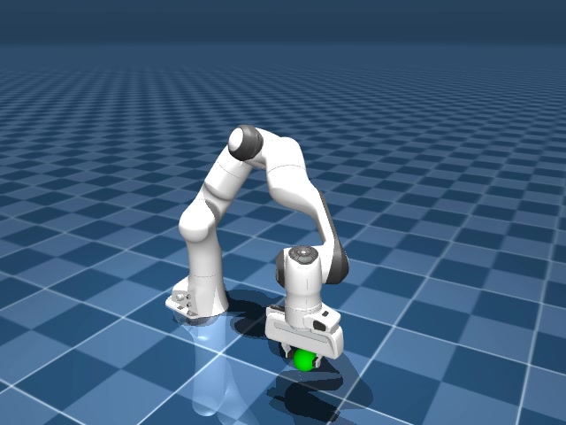
  <br><em>The Panda gripper closing on a moving target in the MuJoCo simulation.</em>
</p>

> **Static vs. dynamic grasping.** Classic pick-and-place assumes the object is *stationary*. Dynamic grasping requires the arm to (1) predict where the object will be, (2) plan an interception it can physically reach in time, (3) track that plan under torque limits, and (4) close the gripper at the precise instant of contact — all in real time.

---

## Table of Contents
1. [Demo Videos](#-demo-videos)
2. [How It Works: the Build-Up](#-how-it-works-the-build-up)
3. [System & Simulation](#1-system--simulation)
4. [Kinematic & Dynamic Modelling](#2-kinematic--dynamic-modelling)
5. [Inverse Kinematics](#3-inverse-kinematics)
6. [Trajectory Planning](#4-trajectory-planning)
7. [Manipulator Control](#5-manipulator-control)
8. [Gripper Mechanics & Static Grasping](#6-gripper-mechanics--static-grasping)
9. [Dynamic Grasping (three algorithms)](#7-dynamic-grasping-three-algorithms)
10. [Results at a Glance](#-results-at-a-glance)
11. [Repository Structure](#-repository-structure)
12. [Running the Code](#-running-the-code)
13. [Authors](#-authors)

---

## 🎥 Demo Videos

All demos run in MuJoCo: a ball is launched across the floor and the arm must intercept and grasp it. Files live in [`videos/`](videos/).

**Plan-then-track** — compute an interception plan once, then track it with the ACADOS MPC controller:

| Planner | What it does | Video |
|---|---|---|
| **Quintic** | Smooth 5th-order polynomial to the intercept pose | [`run_grasping_quintic.mp4`](videos/run_grasping_quintic.mp4) |
| **TOPP-RA** | Time-optimal, torque-limited parameterisation | [`run_grasping_toppra.mp4`](videos/run_grasping_toppra.mp4) |
| **CROFT** | Accelerated rendezvous-point search + TOPP-RA | [`run_grasping_croft.mp4`](videos/run_grasping_croft.mp4) |

**Contractive MPC** — fully online: re-solve an optimal-control problem every step with a per-step error-contraction constraint (no offline planning phase):

| Run | Video |
|---|---|
| Contractive MPC grasp | [`run_contractive_grasping.mp4`](videos/run_contractive_grasping.mp4) |
| Contractive MPC grasp (variant 2) | [`run_contractive_grasping2.mp4`](videos/run_contractive_grasping2.mp4) |

---

## 🧭 How It Works: the Build-Up

The project was developed as a **layered pipeline** — each capability is validated before the next builds on it. This README follows that same order:

```
 Foundations            Step 1        Step 2            Step 3                 Step 4                 Step 5
┌───────────────┐   ┌──────────┐  ┌───────────┐  ┌──────────────────┐  ┌────────────────────┐  ┌────────────────┐
│ Kinematics &  │──►│ Inverse  │─►│  Static   │─►│   Trajectory     │─►│  Dynamic grasping  │─►│    Gripper     │
│ dynamics (PoE)│   │kinematics│  │ grasping  │  │ planning + control│  │  (3 algorithms)    │  │ closure & catch│
└───────────────┘   └──────────┘  └───────────┘  └──────────────────┘  └────────────────────┘  └────────────────┘
   screw theory      analytical vs   4-phase       5 profiles + TOPP-RA   baseline / CROFT /       friction cone,
   FK, Jacobian,     numerical IK    pick-place    FL / SMC / NMPC        contractive MPC          force closure,
   RNEA dynamics     500-pose study  validated     benchmarked            benchmarked              closure timing
```

Static grasping proves the IK → planning → control chain works on a *stationary* object; dynamic grasping then adds the temporal interception problem on top.

---

## 1. System & Simulation

### Robot — Franka Emika Panda (7-DoF)
A redundant, torque-controlled research arm: three shoulder joints, one elbow, and a **spherical wrist** (joints 5–7 intersect at a point). That wrist decoupling is exactly what makes a fast *analytical* IK possible. Reach ≈ 855 mm, payload 3 kg, per-joint torque sensing at 1 kHz. End-effector: the **Franka Hand** parallel-jaw gripper (0–80 mm travel).

<p align="center">
  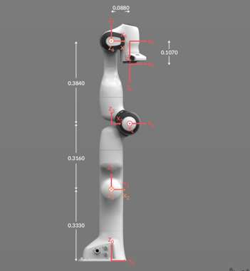
  <br><em>Link geometry used to build the Product-of-Exponentials model (dimensions in metres).</em>
</p>

| Joints | Max torque | Max velocity |
|---|---|---|
| 1–4 | 87 N·m | 2.175 rad/s |
| 5–7 | 12 N·m | 2.610 rad/s |

### Simulator — MuJoCo
All experiments run in **MuJoCo** (Multi-Joint dynamics with Contact) using the official Franka MJCF model with documented per-link inertias. MuJoCo gives ground-truth state, controllable physics, and scriptable batch experiments. The target is a free-floating sphere whose contact with the floor is friction-free, so it slides freely while retaining realistic friction against the gripper pads.

| MuJoCo setting | Value | | Target sphere | Value |
|---|---|---|---|---|
| Timestep | 0.005 s (5 ms) | | Radius | 0.03 m (30 mm) |
| Solver iterations | 5 | | Mass | 0.1 kg |
| Line-search iters | 8 | | Body friction (slide/tors./roll) | 1.5 / 0.5 / 0.1 |
| Integrator | `implicitfast` | | Floor-pair friction | 0 (slides freely) |

<p align="center">
  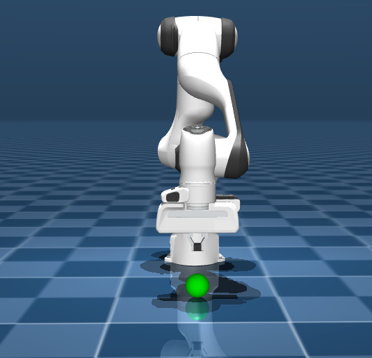
  <br><em>Figure 2.2 — the MuJoCo scene: Franka Panda with the spherical target on the floor plane.</em>
</p>

### Software stack
Python 3.10 · **[MuJoCo](https://mujoco.org/)** (simulation) · **[Pinocchio](https://github.com/stack-of-tasks/pinocchio)** (runtime FK, Jacobians, RNEA/CRBA) · **[ACADOS](https://docs.acados.org/)** (real-time NMPC via SQP-RTI + HPIPM) · **[TOPP-RA](https://github.com/hungpham2511/toppra)** (time-optimal paths) · **[CasADi](https://web.casadi.org/)** (symbolic dynamics / offline IPOPT NLP) · NumPy / SciPy / Matplotlib.

---

## 2. Kinematic & Dynamic Modelling

The whole stack rests on a **Product-of-Exponentials (PoE)** model from screw theory, with every joint represented as a screw axis in the space and body frames:

- **Forward kinematics:** `T(θ) = e^{[S₁]θ₁} … e^{[S₇]θ₇} · M`, giving compact closed-form end-effector poses from the seven joint screw axes and the home configuration `M`.
- **Velocity kinematics:** the 6×7 space and body **Jacobians** relate joint rates to the end-effector twist.
- **Dynamics:** the equation of motion `τ = M(θ)θ̈ + C(θ,θ̇)θ̇ + g(θ) + J(θ)ᵀF_tip + Bθ̇` is built from the **Newton–Euler** recursion in twists and wrenches.

The analytical model was derived and validated in Python, but a pure-Python evaluation of the inertia matrix alone took ≈ 50 ms/step — over 10× the 5 ms control budget. All *runtime* kinematics and dynamics were therefore handed to **Pinocchio** (C++), which supplies `M(θ)` (CRBA), the bias forces `C θ̇ + g` (RNEA), and the Jacobians in 0.1–0.5 ms/step. Pinocchio feeds the computed-torque, SMC, and MPC controllers below.

---

## 3. Inverse Kinematics

**Goal:** given a desired gripper pose `T_d`, find joint angles `θ` with `T(θ) = T_d`. Because the arm has 7 joints for 6 task DoF, solutions form a 1-parameter family (parameterised by the redundant `θ₇`). Two solvers are implemented and compared:

| | **Analytical** (frantik) | **Numerical** (Pinocchio DLS) |
|---|---|---|
| Method | Closed-form; sweeps the redundant `θ₇`, decouples wrist from shoulder | Damped least-squares Jacobian iteration from random seeds |
| Cost | O(1) trigonometry per seed | Up to 25 iterations per seed |
| Robustness near singularities | Can fail (e.g. joint 2 → 0) | Degrades gracefully (damping) |

**Study — 500 random reachable poses, seed count swept 1→49.** The results below show the classic speed-vs-reachability trade-off.

<p align="center">
  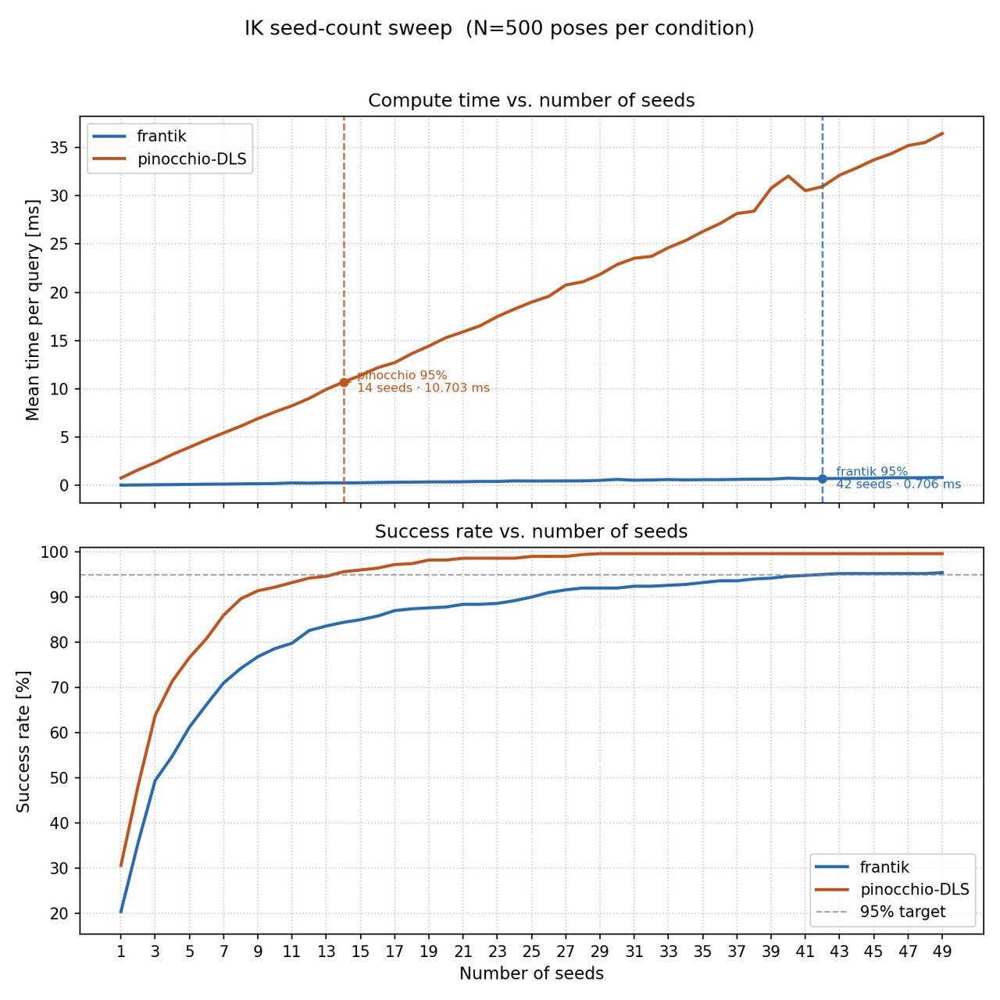
  <br><em>Figure 6.1 — IK seed-count sweep (N = 500 poses). Top: mean solve time per query. Bottom: success rate. Blue: analytical (frantik); orange: numerical (Pinocchio-DLS).</em>
</p>

| Metric (at 95 % success) | Analytical (frantik) | Numerical (Pinocchio-DLS) |
|---|:--:|:--:|
| Seeds to reach 95 % | 42 | 14 |
| Mean solve time | **0.706 ms** | 10.703 ms |
| Time per seed | ~0.017 ms | ~0.76 ms |
| Success ceiling (n = 49) | ~95.4 % | ~99.6 % |

The analytical solver is **~15× faster at the 95 % threshold** (and ~22× faster at 99 %: 0.441 ms vs 9.737 ms), because each seed is a single closed-form evaluation with no iteration. Its success *plateaus* near 95–97 % at singular configurations, whereas the numerical solver keeps improving to 99.6 %. Since the intercept planners call IK repeatedly at real-time rates, the **analytical solver is the default** (a seed count of `n = 8` already balances > 97.5 % success with < 0.2 ms); the numerical solver is kept as a high-reachability fallback.

---

## 4. Trajectory Planning

Trajectories are generated in **joint space** (guaranteeing feasibility and trivially enforcing per-joint limits). Five profiles are implemented; **TOPP-RA** is the workhorse and **quintic** the smooth baseline.

| Profile | Continuity | Duration | Torque-limit aware |
|---|---|---|:--:|
| Trapezoidal | C⁰ vel. | min for given v,a | ✗ |
| S-curve (7-stage) | C¹ vel. | ~3–5 % longer | ✗ |
| Cubic | C¹ pos. | user-set | ✗ |
| Quintic | C² pos. | user-set | ✗ |
| **TOPP-RA** | C⁰ accel. | **provably optimal** | **✓ (hard LP)** |

**TOPP-RA** (Time-Optimal Path Parameterisation via Reachability Analysis) turns the joint torque/velocity bounds into scalar constraints on `(s̈, ṡ²)` and solves two passes of small linear programmes, producing the minimum-time profile that saturates the actuator limits. The quintic profile keeps zero velocity *and* acceleration at both endpoints for smoothness.

<p align="center">
  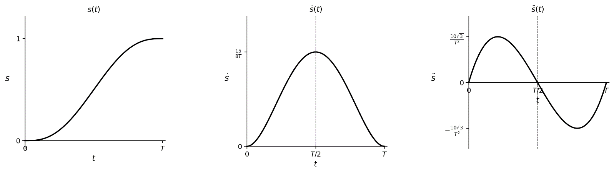
  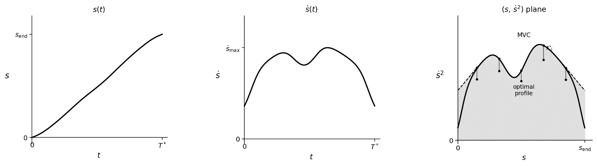
  <br><em>Figure 4.4 (quintic) and Figure 4.5 (TOPP-RA). TOPP-RA saturates the velocity and torque limits simultaneously, giving the shortest feasible motion.</em>
</p>

---

## 5. Manipulator Control

Three controllers are developed, each using the runtime dynamics from Section 2:

| Controller | Idea | Strength |
|---|---|---|
| **Feedback Linearisation** (computed torque) | Cancel the nonlinear dynamics → decoupled double integrators driven by a PD law | Simplest; fastest to evaluate (< 0.07 ms) |
| **Adaptive SMC** | Sliding surface `s = ė + Λe`; boundary-layer saturation removes chatter; switching gain adapts online | Best disturbance rejection |
| **Nonlinear MPC** (ACADOS SQP-RTI) | Receding-horizon OCP with hard joint/torque constraints; one real-time iteration per step, solved by HPIPM | Best tracking accuracy & lowest energy |

They are validated first on **point stabilisation** (regulate to a fixed target), then on **trajectory tracking** — the same two experiments for all three controllers, for a like-for-like comparison.

### Point stabilisation — regulate to a target
The arm is driven from home to a large-displacement pre-grasp configuration and must hold it. Per-joint position error over time, one plot per controller:

<p align="center">
  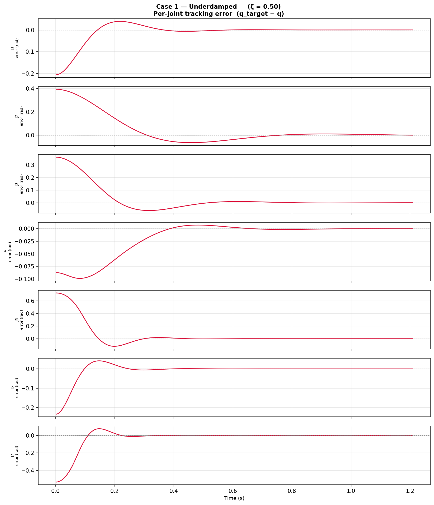
  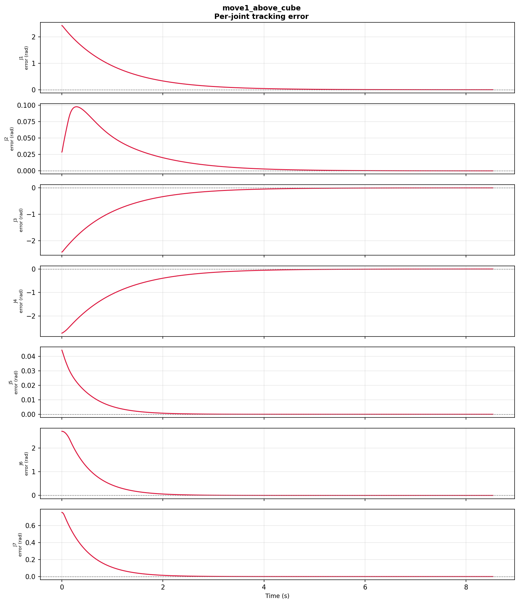
  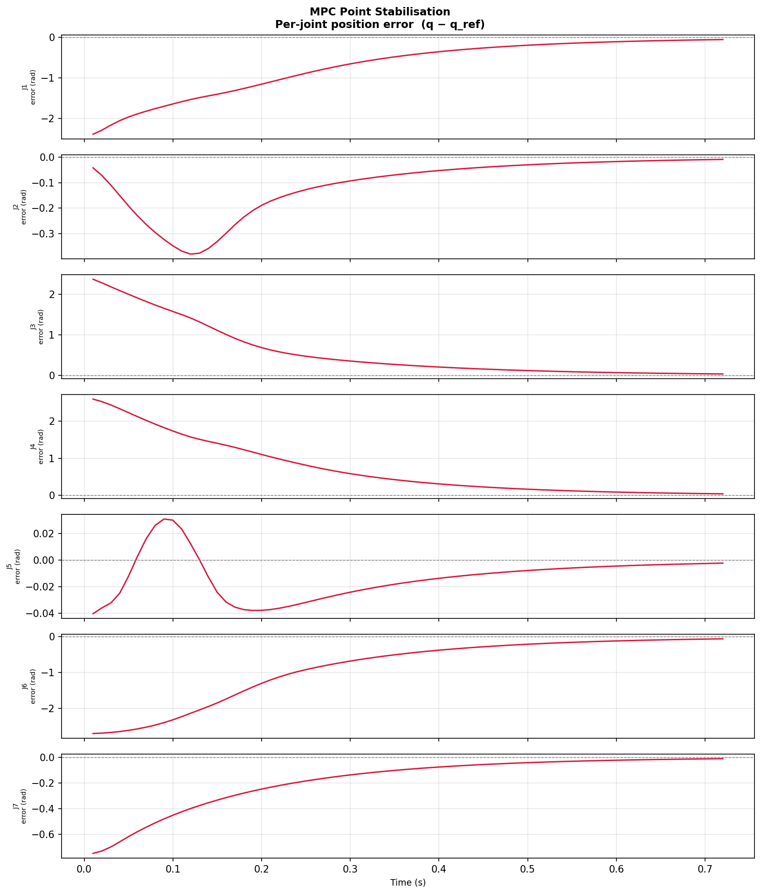
  <br><em>Per-joint error vs time — Figure 6.2 (Feedback Linearisation, ζ = 0.5), Figure 6.9 (SMC), Figure 6.17 (MPC). All drive the error to zero; FL under critical damping (ζ = 1) settles cleanly in ~0.8 s, SMC converges monotonically below 1 mrad, and MPC settles all joints in ~0.7 s.</em>
</p>

### Trajectory tracking — follow a TOPP-RA reference
The same TOPP-RA reference is tracked by each controller; actual vs desired joint positions:

<p align="center">
  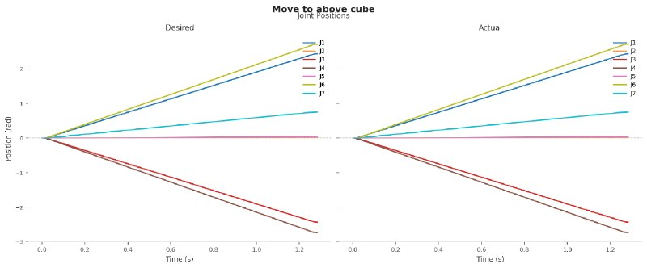
  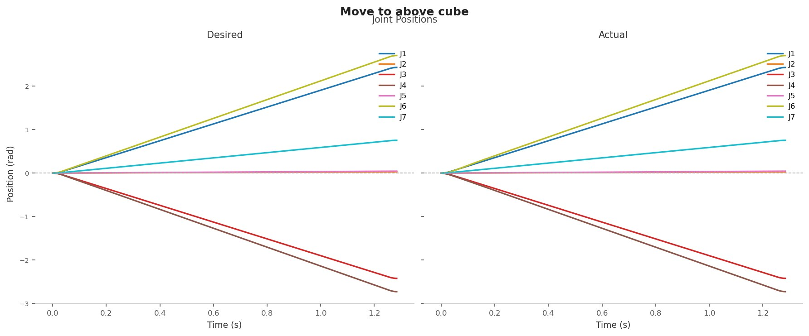
  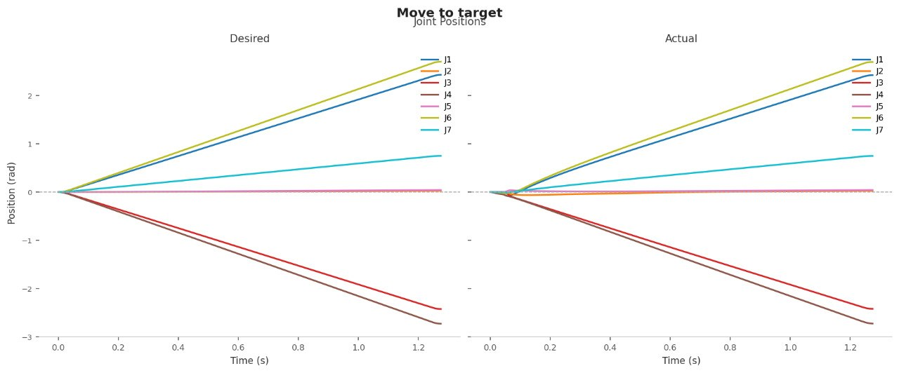
  <br><em>Actual vs desired, TOPP-RA profile — Figure 6.7 (FL), Figure 6.14 (SMC), Figure 6.19 (MPC).</em>
</p>

### Benchmark
Over **300 target configurations × 2 profiles (TOPP-RA / quintic) × 3 conditions** (nominal, torque disturbance, sensor noise):

| Controller | Nominal RMSE (rad) ↓ | Step time | Disturbance robustness |
|---|:--:|:--:|:--:|
| **MPC · TOPP-RA** | **0.00694** | 3.4–3.7 ms | RMSE +4.1 % |
| SMC · TOPP-RA | 0.01413 | 0.12–0.14 ms | **+1.2 % (best)** |
| FL · TOPP-RA | 0.01843 | **< 0.07 ms** | +4.3 % |

- **MPC** has the lowest RMSE (≈ 2× better than SMC, 2.7× better than FL) and lowest control energy, and respects all joint limits (0 % violations).
- **SMC** rejects disturbances best in relative terms; **FL** is the cheapest to compute.
- Settling times cluster by **planner** (TOPP-RA ≈ 1.13 s vs quintic ≈ 1.85 s) more than by controller — the reference generator matters as much as the control law. **MPC · TOPP-RA** is chosen for the dynamic-grasping experiments.

---

## 6. Gripper Mechanics & Static Grasping

**Grasp mechanics.** Securing the catch is a contact-physics problem, analysed with the **Franka Hand** parallel-jaw model. Each pad must satisfy the Coulomb no-slip condition `Fᵢ ≤ μ_eff·Nᵢ` with `μ_eff = (μ_sphere + μ_finger)/2`, and the minimum normal force to resist gravity is `F_min = mg / (2 μ_eff)`. Closure is **two-phase**: a position-controlled phase closes the fingers to just above the sphere diameter, then a force-regulated phase squeezes until the measured contact force exceeds `F_min`. For a parallel-jaw grasp on a sphere the grasp matrix has rank 1 under frictionless contact, rising to **rank 6 (force closure)** once friction and sufficient normal force are applied.

<p align="center">
  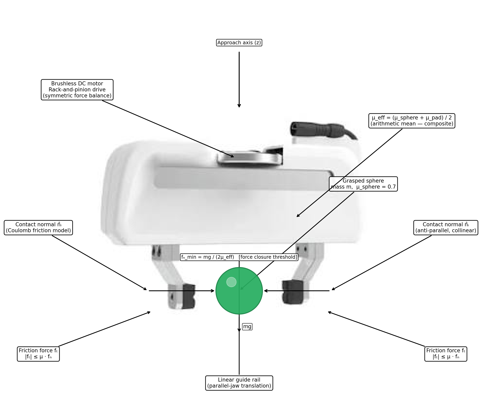
  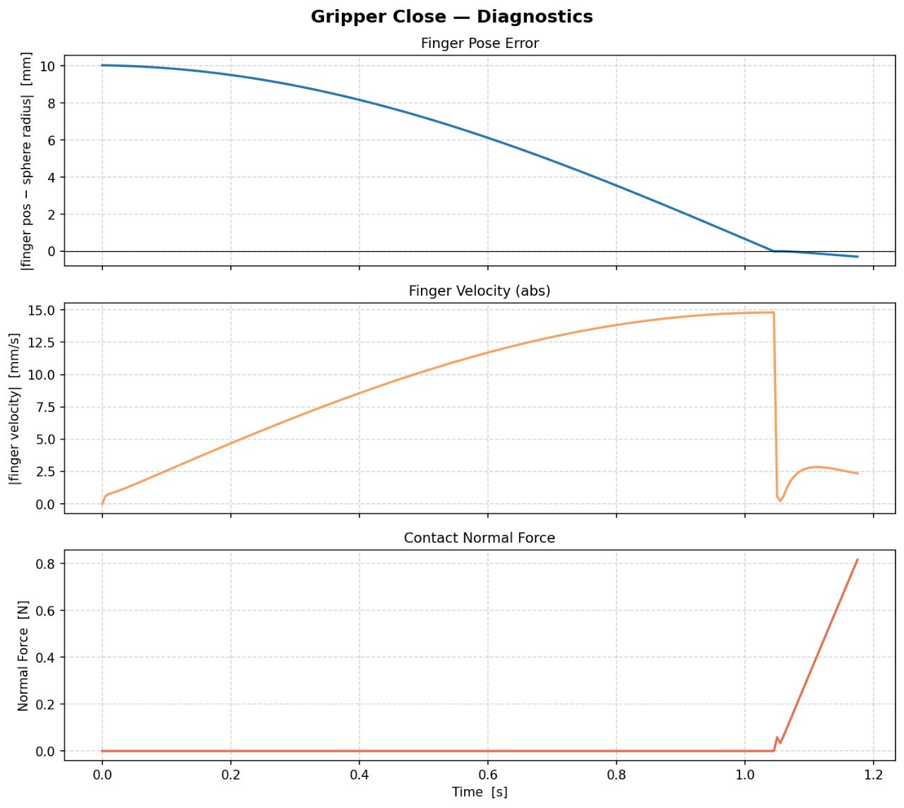
  <br><em>Figure 5.3 — gripper contact geometry; Figure 6.20 — the two-phase closure experiment (finger position/velocity and the normal-force ramp to F_min).</em>
</p>

**Static grasping.** Before chasing a moving ball, the full pipeline is validated on a *stationary* sphere in four phases — **approach** to a pre-grasp pose above the object, **descent** to the grasp pose, **two-phase gripper closure**, and **lift & transport** to a drop-off. Across ball positions spread over the reachable workspace, the arm intercepted and relocated the sphere in every tested configuration, confirming the kinematics → planning → control → gripper chain works end-to-end.

---

## 7. Dynamic Grasping (three algorithms)

Now the object *moves*. Dynamic grasping is posed as **intercept-point (rendezvous) planning**: find an interception time `t*` and a grasp pose the arm can reach *before* the ball arrives, subject to torque limits. Three algorithms of increasing sophistication were developed and benchmarked — see the [demo videos](#-demo-videos).

**① Feasible Intercept Search (forward scan).** Scan candidate rendezvous times from `t_min` in 50 ms steps; at each, predict the ball position, check the workspace, solve IK for the pre-grasp and grasp poses, and estimate quintic segment durations. Return the first time satisfying `T₁ + T₂ + T_grip + ε ≤ t`. Simple but does a dense scan of expensive evaluations.

**② CROFT — accelerated rendezvous search.** Treats interception as root-finding on the feasibility residual `f(t) = T_arm(t) + T_grip − t` (the arm makes it iff `f(t) ≤ 0`, i.e. where the arm-arrival time `r(t)` meets the line `h(t) = t`). Instead of a dense scan it computes the **reachable window**, seeds both ends, then fits a low-order **surrogate `r(t)`** and takes the earliest root of `r(t) = t`, scoring candidates by an **interception-time objective**. It stops on a **temporal-convergence** test (don't plan longer than the improvement is worth) plus a 2-worsening counter, and runs TOPP-RA *inside* each evaluation so the returned trajectory already respects the limits.

**③ Contractive MPC.** Fully online — no offline plan. Every MPC step appends a per-step **contraction constraint** on the joint-position error:

```
‖q(k) − q_ref‖ ≤ α · ‖q(k−1) − q_ref‖ ,   α = max(α_req, α_min)
```

with `α_req = (ε/‖e‖)^{1/N}` (the rate needed to reach tolerance `ε` in `N` steps) and `α_min` the physical feasibility floor set by the joint velocity limits. This gives a provable bound `‖e_k‖ ≤ αᵏ‖e₀‖` — the error contracts geometrically every step — while the intercept is refreshed from the live ball state.

### Benchmark — 200 ball launches (reaching the workspace)

| Algorithm | Success rate ↑ | Catch time | Grasp error | Notes |
|---|:--:|:--:|:--:|---|
| Feasible Intercept Search | 89.8 % | 3.53 s | 3.22 mm | dense forward scan |
| **CROFT** | **92.5 %** | 3.42 s | **3.14 mm** | surrogate search (~0.16 s), best overall |
| Contractive MPC | 76.2 % | **2.52 s** | 3.85 mm | fully online, no planning phase; higher jerk |

**CROFT-Base vs CROFT-Tracking** — an add-on that re-solves the grasp pose from the live ball state during closure:

| Variant | Success | Grasp distance error |
|---|:--:|:--:|
| CROFT-Base (open-loop) | 92.5 % | 3.13 mm |
| CROFT-Tracking (re-plan during closure) | 68.8 % | **0.462 mm** |

CROFT-Base catches more often; CROFT-Tracking tightens alignment by **85 %** (valuable for sub-5 mm objects) but its continuous re-solve occasionally misses the interception window — a clean success-rate vs. accuracy trade-off.

---

## 📊 Results at a Glance

| Stage | Key result |
|---|---|
| **Inverse kinematics** | Analytical solver **~15× faster** at 95 % success (0.706 ms vs 10.703 ms), ~22× at 99 %. |
| **Trajectory planning** | TOPP-RA is provably time-optimal and torque-limited; settles ≈ 1.13 s vs ≈ 1.85 s for quintic. |
| **Control** | **MPC** lowest RMSE (0.00694 rad) & energy; **SMC** best disturbance rejection; **FL** fastest (< 0.07 ms/step). |
| **Static grasping** | Four-phase pick-and-place validated across the reachable workspace. |
| **Dynamic grasping** | **CROFT 92.5 %** success at ≈ 0.16 s planning; Contractive MPC fully online (2.52 s catch). |
| **Gripper** | Two-phase closure to `F_min = mg/(2 μ_eff)`; grasp matrix reaches rank 6 (force closure). |

---

## 📁 Repository Structure

```
.
├── report.pdf                    # full written thesis report
├── src/
│   ├── franka_grasping/          # main, cleaned-up codebase
│   │   ├── shared/               #   dynamics, both IK solvers, trajectory & control laws,
│   │   │                         #   ACADOS OCP builder (incl. contractive variant), gripper
│   │   ├── point_stabilization/  #   regulate to a fixed target (MPC / FL / SMC)
│   │   ├── trajectory_tracking/  #   track quintic / TOPP-RA references + benchmarks
│   │   └── dynamic_grasping/     #   intercept-and-grasp: forward scan, CROFT, contractive MPC
│   │                             #   (dg_common.py holds the shared grasping helpers)
│   └── xml and meshes/           # Franka MJCF/URDF model + meshes + scene files
├── videos/                       # the five MuJoCo demos
└── docs/images/                  # figures used in this README (report figures + hero frame)
```

See [`src/franka_grasping/README.md`](src/franka_grasping/README.md) for a module-by-module description and the old→new file mapping.

---

## ▶️ Running the Code

Each script runs with plain `python <script>.py` from anywhere. Anything using MPC needs its **ACADOS solver built first**:

```bash
# --- dynamic grasping (plan-then-track NMPC) ---
cd src/franka_grasping/dynamic_grasping
python build_solver.py               # NMPC solver  (add --planning for the benchmark)
python run_grasping_nmpc.py croft    # CROFT + NMPC intercept-and-grasp

# --- contractive MPC grasping ---
python build_contractive_solver.py
python run_contractive_grasping.py

# --- compare all three grasping methods ---
python benchmark_grasping_methods.py
```

**Dependencies:** `mujoco`, `pinocchio`, `acados_template` (+ the ACADOS C library), `toppra`, `casadi`, `frantik`, `modern_robotics`, `numpy`, `scipy`.

---

## 👥 Authors

**Alaa Hussein** · **Haidar Saad** — supervised by **PhD Essa Alghannam**, Manara University, Faculty of Engineering (Robotics and Intelligent Systems), 2025/2026.

The full written report (all derivations, proofs, and complete result tables) accompanies this project.
