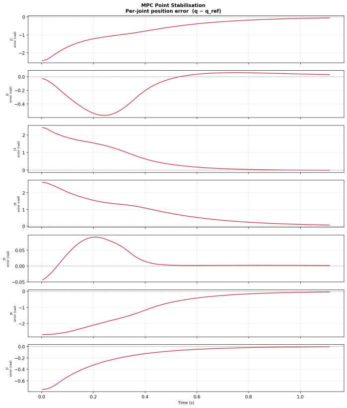
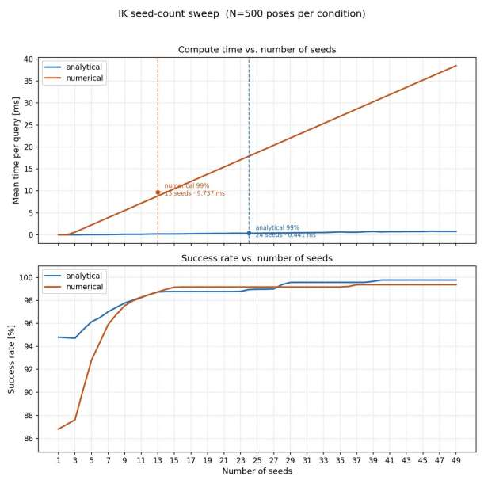
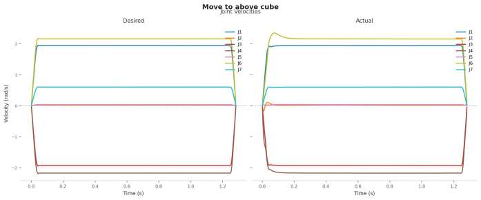
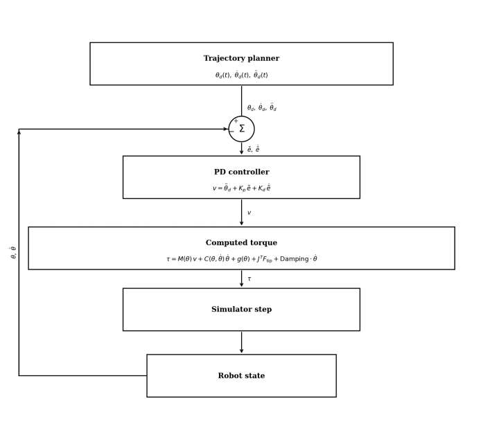
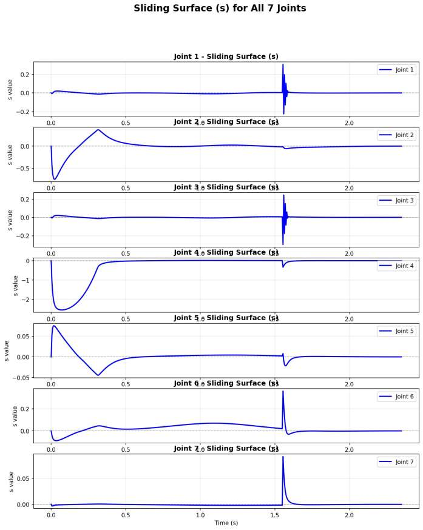
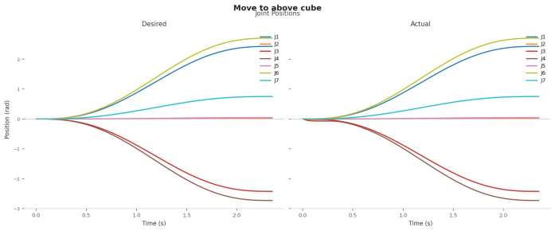

# Dynamic Object Grasping Using a 7-DoF Manipulator

A full-stack framework for **catching moving objects** with the **Franka Emika Panda** 7-DoF robot arm, simulated in **MuJoCo**. The project spans the entire manipulation pipeline — kinematic & dynamic modelling, inverse kinematics, trajectory planning, real-time control, and three dynamic-grasping algorithms — and benchmarks each stage in simulation.

> Unlike classic pick-and-place (where the object is static), **dynamic grasping** requires the arm to plan an interception, execute it within a tight time budget, and close the gripper at the exact instant the object arrives — all in real time.

<p align="center">
  
  
</p>

---

## 🎥 Demo Videos

All demos run in MuJoCo with a ball rolling across the workspace that the arm must intercept and grasp. Videos are in [`videos/`](videos/).

**Approach A — Plan-then-track** (compute an interception trajectory, then track it):

| Planner | Video |
|---|---|
| Quintic polynomial trajectory | [`run_grasping_quintic.mp4`](videos/run_grasping_quintic.mp4) |
| TOPP-RA time-optimal trajectory | [`run_grasping_toppra.mp4`](videos/run_grasping_toppra.mp4) |
| **CROFT** accelerated intercept search | [`run_grasping_croft.mp4`](videos/run_grasping_croft.mp4) |

**Approach B — Contractive MPC** (closed-loop: replan every step, drive the arm toward the predicted object position with a contraction guarantee):

| Run | Video |
|---|---|
| Contractive MPC grasp | [`run_contractive_grasping.mp4`](videos/run_contractive_grasping.mp4) |
| Contractive MPC grasp (v2) | [`run_contractive_grasping2.mp4`](videos/run_contractive_grasping2.mp4) |

---

## 🤖 System

**Robot — Franka Emika Panda (7-DoF).** A redundant, torque-controlled serial arm: three shoulder joints, one elbow, and a **spherical wrist** (the wrist decoupling is what makes an analytical closed-form IK possible). Reach ≈ 855 mm, payload 3 kg, joint torque sensing at 1 kHz. The end-effector is the **Franka Hand** parallel-jaw gripper (max 70 N grip, 0–80 mm travel).

**Simulator — MuJoCo** (Multi-Joint dynamics with Contact). All experiments use the official Franka MJCF model with per-link inertial properties from Franka's documentation.

| MuJoCo setting | Value |
|---|---|
| Timestep | 5 ms |
| Integrator | `implicitfast` |
| Contact solver | Newton |
| Sliding friction | 0.8 |

**Software stack:** Python 3.10 · [MuJoCo](https://mujoco.org/) (simulation) · [Pinocchio](https://github.com/stack-of-tasks/pinocchio) (kinematics, Jacobians, RNEA) · [ACADOS](https://docs.acados.org/) (real-time NMPC, SQP-RTI) · [TOPP-RA](https://github.com/hungpham2511/toppra) (time-optimal paths) · [CasADi](https://web.casadi.org/) (symbolic differentiation) · NumPy/SciPy/Matplotlib.

---

## 🧩 The Pipeline

```
Object trajectory  ──►  Interception planner  ──►  Trajectory generator  ──►  Real-time controller  ──►  Gripper timing
   p_obj(t)              (find t*, pose T*)         (quintic / TOPP-RA)        (FL / SMC / MPC)           (close on contact)
```

### 1. Kinematics & Inverse Kinematics
The forward kinematics and spatial Jacobian are derived from **screw theory** using the **Product of Exponentials (PoE)** formulation. Two IK solvers are compared over **500 random poses**:

- **Analytical (closed-form)** — exploits the spherical wrist.
- **Numerical (Damped Least-Squares)** — via Pinocchio.

The analytical solver reaches **99 % success with 24 seeds at 0.44 ms**, a **22× speedup** over the numerical solver (9.7 ms), which is why the planners use it.

<p align="center"></p>

### 2. Trajectory Planning
Five profile types are implemented: trapezoidal, 7-segment S-curve, cubic, quintic, and **TOPP-RA** (Time-Optimal Path Parameterisation via Reachability Analysis). TOPP-RA produces the **shortest feasible trajectory times** while respecting joint torque/velocity limits — e.g. ≈ 1.3 s vs 2.3 s for a comparable quintic profile.

<p align="center"></p>

### 3. Control
Three controllers are developed and benchmarked over 50 random trajectories:

| Controller | Idea |
|---|---|
| **Feedback Linearisation** (computed-torque) | Cancel the nonlinear dynamics, then PD on the error. |
| **Adaptive Sliding Mode Control** | Robust boundary-layer control; handles model error without chattering. |
| **Nonlinear MPC** (ACADOS SQP-RTI) | Predictive optimal control, **1–5 ms/step** — well within the control budget. |

**MPC wins on tracking RMSE**, followed by SMC, then FL; and **TOPP-RA references beat quintic** across all three controllers.

<p align="center">
  
  
</p>
<p align="center"><em>Left: computed-torque control loop. Right: SMC sliding surfaces reaching the boundary layer within ≈ 0.3 s.</em></p>

---

## 🎯 Dynamic Grasping Algorithms

Dynamic grasping is posed as an **intercept-point planning** problem: find an interception time `t*` and pose `T*` the end-effector can reach before the object arrives, subject to torque limits. Three algorithms of increasing sophistication:

**① Baseline intercept planner** — forward scan over candidate interception times; one TOPP-RA call per candidate (up to ~60 calls). Simple but expensive.

**② CROFT** — exploits the *monotonic* relationship between required trajectory time and available time window, replacing the scan with **bracketed root-finding**. Terminates in 3–5 bisection steps → **~20× fewer TOPP-RA evaluations**, same or better success.

**③ Contractive MPC** — closed-loop: instead of planning-then-tracking, it solves a constrained optimal-control problem every step with an added **contraction constraint** `‖e(k+1)‖² ≤ α²‖e(k)‖²` (slack-relaxed for feasibility). This *guarantees geometric convergence* of the end-effector to the object at rate α per step; the gripper closes when the distance drops below 15 mm.

### Results (100 trials per algorithm)

| Algorithm | Success rate |
|---|:--:|
| Baseline intercept planner | 89.8 % |
| **CROFT** | **92.3 %** |
| Contractive MPC | 76.2 % |

CROFT gives the best success/cost trade-off. A further comparison shows **CROFT-Base** (open-loop) hits 92.5 % success with 3.13 mm alignment error, while **CROFT-Tracking** (replans every 50 ms) tightens alignment to **0.46 mm** but drops to 68.8 % — over-aggressive replanning occasionally misses the interception window.

---

## 📊 Selected Results at a Glance

- **IK:** analytical solver 22× faster than numerical at equal accuracy.
- **Trajectory:** TOPP-RA ~40 % shorter motion times than quintic under the same limits.
- **Control:** MPC lowest RMSE; ACADOS solves in 1–5 ms/step vs 50–300 ms for offline CasADi/IPOPT.
- **Grasping:** CROFT 92.3 % success at ~20× lower planning cost than the baseline.

<p align="center"></p>

---

## 📁 Repository Structure

```
.
├── ALL_CODES/
│   ├── refractored/              # main, cleaned-up codebase
│   │   ├── shared/               #   dynamics, IK, trajectory & control laws, ACADOS OCP builder, gripper
│   │   ├── point_stabilization/  #   regulate to a fixed joint target (MPC / FL / SMC)
│   │   ├── trajectory_tracking/  #   track quintic / TOPP-RA references + benchmarks
│   │   └── dynamic_grasping/     #   intercept-and-grasp: baseline, CROFT, contractive MPC
│   └── xml and meshes/           # Franka MJCF/URDF model + meshes
├── videos/                       # simulation demos (see above)
└── docs/images/                  # figures used in this README
```

See [`ALL_CODES/refractored/README.md`](ALL_CODES/refractored/README.md) for a detailed module-by-module description and the old→new file mapping.

## ▶️ Running

Each script runs with plain `python <script>.py` from anywhere. For anything using MPC, **build the matching ACADOS solver first**:

```bash
# dynamic grasping (plan-then-track NMPC)
cd ALL_CODES/refractored/dynamic_grasping
python build_solver.py                 # NMPC solver  (add --planning for the benchmark)
python run_grasping_nmpc_croft.py      # CROFT + NMPC grasp

# contractive MPC grasping
python build_contractive_solver.py
python run_contractive_grasping.py

# benchmark all three grasping methods
python benchmark_grasping_methods.py
```

**Dependencies:** `mujoco`, `pinocchio`, `acados_template` (+ the ACADOS C library), `toppra`, `casadi`, `frantik`, `modern_robotics`, `numpy`, `scipy`.

---

## 👥 Authors

**Alaa Hussein** · **Haidar Saad**

Graduation thesis — *Dynamic Object Grasping Using a 7-DoF Manipulator*. The full written report (theory, derivations, and complete result tables) accompanies this repository.
