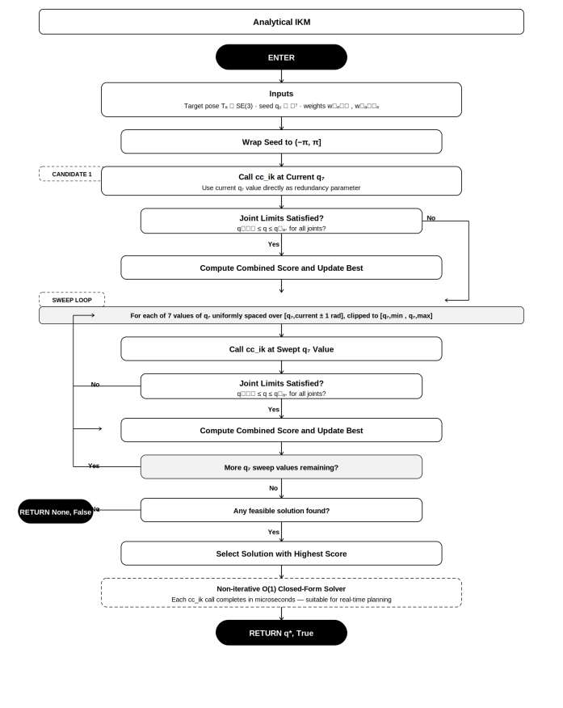
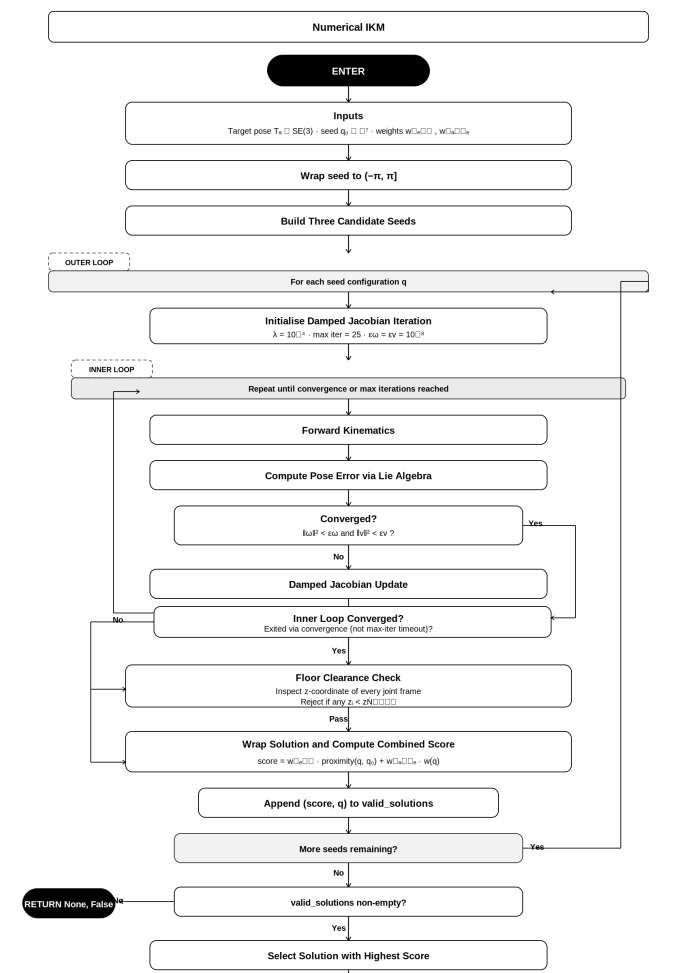
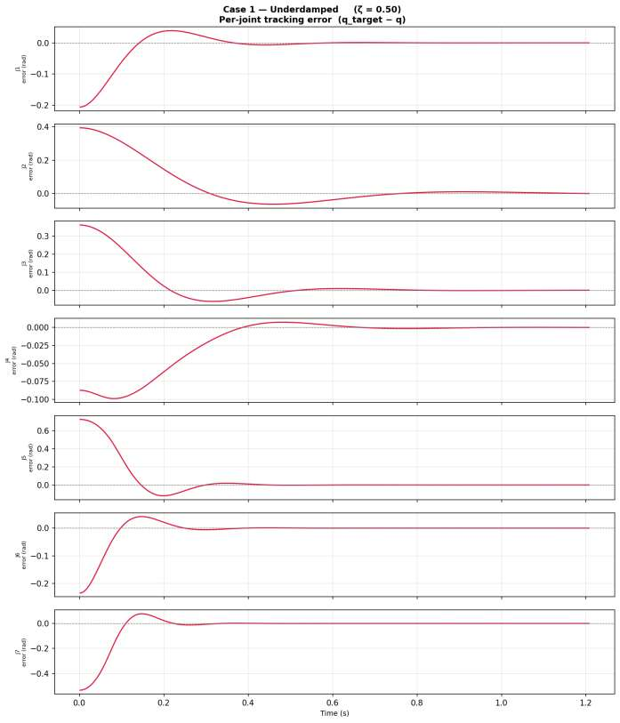
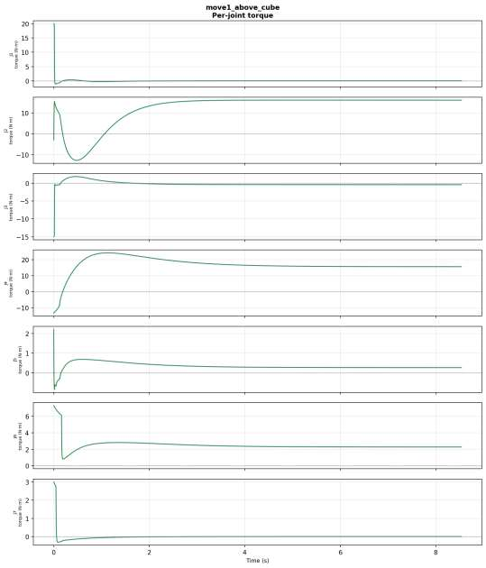
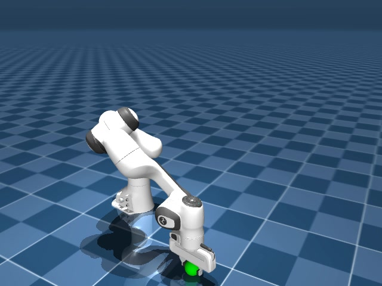

# Dynamic Object Grasping Using a 7-DoF Manipulator

**Catching a moving object with the Franka Emika Panda, simulated end-to-end in MuJoCo.**

This project builds the *entire* manipulation stack needed to grasp objects that move through the workspace — from screw-theory kinematics and inverse kinematics, through trajectory planning and real-time control, up to three dynamic-grasping algorithms and the gripper-closure logic that secures the catch. Every stage is implemented in Python and evaluated in the **MuJoCo** physics simulator on a 7-DoF Franka Panda.

<p align="center">
  
  <br><em>The Panda gripper closing on a moving target in the MuJoCo simulation.</em>
</p>

> **Static vs. dynamic grasping.** Classic pick-and-place assumes the object is *stationary*. Dynamic grasping requires the arm to (1) predict where the object will be, (2) plan an interception it can physically reach in time, (3) track that plan under torque limits, and (4) close the gripper at the precise instant of contact — all in real time.

---

## Table of Contents
1. [Demo Videos](#-demo-videos)
2. [How It Works: the Build-Up](#-how-it-works-the-build-up)
3. [System & Simulation](#1-system--simulation)
4. [Foundations: Kinematics & Dynamics](#2-foundations-kinematics--dynamics)
5. [Step 1 — Inverse Kinematics](#3-step-1--inverse-kinematics)
6. [Step 2 — Static Grasping](#4-step-2--static-grasping)
7. [Step 3 — Trajectory Planning & Tracking Control](#5-step-3--trajectory-planning--tracking-control)
8. [Step 4 — Dynamic Grasping (three algorithms)](#6-step-4--dynamic-grasping-three-algorithms)
9. [Step 5 — Gripper Closure & Grasp Stability](#7-step-5--gripper-closure--grasp-stability)
10. [Results at a Glance](#-results-at-a-glance)
11. [Repository Structure](#-repository-structure)
12. [Running the Code](#-running-the-code)
13. [Authors](#-authors)

---

## 🎥 Demo Videos

All demos run in MuJoCo: a ball is launched across the workspace and the arm must intercept and grasp it. Files live in [`videos/`](videos/).

**Approach A — Plan-then-track.** Compute an interception trajectory once, then track it with a controller. Three planners:

| Planner | What it does | Video |
|---|---|---|
| **Quintic** | Smooth 5th-order polynomial to the intercept pose | [`run_grasping_quintic.mp4`](videos/run_grasping_quintic.mp4) |
| **TOPP-RA** | Time-optimal parameterisation (fastest feasible) | [`run_grasping_toppra.mp4`](videos/run_grasping_toppra.mp4) |
| **CROFT** | Accelerated intercept search (~20× fewer solves) | [`run_grasping_croft.mp4`](videos/run_grasping_croft.mp4) |

**Approach B — Contractive MPC.** Closed-loop: re-solve an optimal-control problem every step, with a contraction constraint that *guarantees* the gripper gets strictly closer to the object each step.

| Run | Video |
|---|---|
| Contractive MPC grasp | [`run_contractive_grasping.mp4`](videos/run_contractive_grasping.mp4) |
| Contractive MPC grasp (variant 2) | [`run_contractive_grasping2.mp4`](videos/run_contractive_grasping2.mp4) |

---

## 🧭 How It Works: the Build-Up

The project was developed as a **layered pipeline** — each capability is validated before the next builds on it. This README follows that same order:

```
 Foundations            Step 1        Step 2            Step 3                 Step 4                 Step 5
┌───────────────┐   ┌──────────┐  ┌───────────┐  ┌──────────────────┐  ┌────────────────────┐  ┌────────────────┐
│ Kinematics &  │──►│ Inverse  │─►│  Static   │─►│   Trajectory     │─►│  Dynamic grasping  │─►│    Gripper     │
│ dynamics (PoE)│   │kinematics│  │ grasping  │  │ planning + control│  │  (3 algorithms)    │  │ closure & catch│
└───────────────┘   └──────────┘  └───────────┘  └──────────────────┘  └────────────────────┘  └────────────────┘
   screw theory      analytical vs   4-phase       5 profiles + TOPP-RA   baseline / CROFT /       friction cone,
   FK, Jacobian,     numerical IK    pick-place    FL / SMC / NMPC        contractive MPC          force closure,
   RNEA dynamics     500-pose study  validated     benchmarked            benchmarked              closure timing
```

Static grasping proves the IK → planning → control chain works on a *stationary* object; dynamic grasping then adds the temporal interception problem on top.

---

## 1. System & Simulation

### Robot — Franka Emika Panda (7-DoF)
A redundant, torque-controlled research arm: three shoulder joints, one elbow, and a **spherical wrist** (joints 5–7 intersect at a point). That wrist decoupling is exactly what makes a fast *analytical* IK possible. Reach ≈ 855 mm, payload 3 kg, per-joint torque sensing at 1 kHz. End-effector: the **Franka Hand** parallel-jaw gripper (0–80 mm travel, up to 70 N).

<p align="center">
  
  <br><em>Link geometry used to build the Product-of-Exponentials model (dimensions in metres).</em>
</p>

| Joints | Max torque | Max velocity |
|---|---|---|
| 1–4 | 87 N·m | 2.175 rad/s |
| 5–7 | 12 N·m | 2.610 rad/s |

### Simulator — MuJoCo
All experiments run in **MuJoCo** (Multi-Joint dynamics with Contact) using the official Franka MJCF model with documented per-link inertias. MuJoCo gives ground-truth state, controllable physics, and scriptable batch experiments.

| MuJoCo setting | Value | | Target object (ball) | Value |
|---|---|---|---|---|
| Timestep | 5 ms | | Radius | 30 mm |
| Integrator | `implicitfast` | | Mass | 50 g |
| Contact solver | Newton | | Slide friction | 0.8 |
| Slide friction | 0.8 | | Launch speed | 0.3–0.8 m/s |

### Software stack
Python 3.10 · **[MuJoCo](https://mujoco.org/)** (simulation) · **[Pinocchio](https://github.com/stack-of-tasks/pinocchio)** (FK, Jacobians, RNEA/CRBA) · **[ACADOS](https://docs.acados.org/)** (real-time NMPC via SQP-RTI + HPIPM) · **[TOPP-RA](https://github.com/hungpham2511/toppra)** (time-optimal paths) · **[CasADi](https://web.casadi.org/)** (symbolic diff / offline NLP) · `cc_ik` (closed-form IK) · NumPy / SciPy / Matplotlib.

---

## 2. Foundations: Kinematics & Dynamics

The whole stack rests on a **Product-of-Exponentials (PoE)** model from screw theory:

- **Forward kinematics:** `T(θ) = e^{[S₁]θ₁} … e^{[S₇]θ₇} · M`, giving compact closed-form end-effector poses from the 7 joint screw axes and the home configuration `M`.
- **Velocity kinematics:** the 6×7 space/body **Jacobians** relate joint rates to end-effector twist, and expose the arm's singularities.
- **Dynamics:** the equation of motion `τ = M(θ)θ̈ + C(θ,θ̇)θ̇ + g(θ) + Dθ̇` is evaluated with the **Recursive Newton–Euler Algorithm (RNEA)** and **CRBA** mass matrix (via Pinocchio) — the same terms feed the computed-torque, SMC, and MPC controllers below.

This model is what every later stage calls into: IK inverts it, TOPP-RA respects its torque limits, and the controllers cancel/predict its nonlinearities.

---

## 3. Step 1 — Inverse Kinematics

**Goal:** given a desired gripper pose `T_d`, find joint angles `θ` with `T(θ) = T_d`. Because the arm has 7 joints for 6 task DoF, solutions form a 1-parameter family. Two solvers are implemented and compared:

| | **Analytical** (`cc_ik`) | **Numerical** (Pinocchio DLS) |
|---|---|---|
| Method | Closed-form; exploits the spherical wrist, sweeps the redundant `θ₇` | Damped least-squares Jacobian iteration from random seeds |
| Cost | O(1) trigonometry | Iterative, matrix inverse per step |
| Robustness near limits | Can fail | Degrades gracefully (damping) |

<p align="center">
  
  
  <br><em>Left: analytical closed-form solver. Right: numerical damped-least-squares solver.</em>
</p>

**Study — 500 random poses, seed count swept 1→49.** The analytical solver reaches **99 % success at 24 seeds in 0.44 ms**; the numerical solver hits 99 % at 13 seeds but at **9.74 ms — 22× slower per call**. Since dynamic-grasping planners call IK repeatedly inside a loop, the analytical solver is used for planning; the numerical one is kept as a near-limit fallback.

<p align="center"></p>

| Solver | Seeds @ 99 % | Success | Solve time | Rel. cost |
|---|:--:|:--:|:--:|:--:|
| **Analytical (cc_ik)** | 24 | 99.0 % | **0.441 ms** | **1.0×** |
| Numerical (Pinocchio DLS) | 13 | 99.0 % | 9.737 ms | 22.1× |

---

## 4. Step 2 — Static Grasping

Before chasing a moving ball, the pipeline is validated on a **stationary** object. This proves the IK → trajectory → control chain end-to-end. The task is split into four phases:

```
 Phase 1          Phase 2         Phase 3            Phase 4
 Approach   ───►  Descent   ───►  Gripper Closure ─► Lift & Transport
 (pre-grasp,      (100 mm along   (close @ 20 mm/s,  (lift 150 mm, move
  100 mm above,   approach axis)  10 N target force,  to drop-off pose,
  quintic traj.)                  contact detection)  quintic traj.)
```

- **Phase 1 – Approach:** analytical IK (24 seeds) to a pre-grasp pose 100 mm above the object; quintic trajectory to get there.
- **Phase 2 – Descent:** a short 100 mm Cartesian descent to the grasp pose, as a separate segment for fine positioning.
- **Phase 3 – Closure:** fingers close at 20 mm/s toward a 10 N grip; contact is detected when finger velocity drops below threshold.
- **Phase 4 – Lift & transport:** lift 150 mm, then a quintic trajectory to the drop-off pose.

**Validation:** 20 trials across 5 workspace locations (NMPC controller) — **all 20 succeed**, mean approach time 1.8 s (TOPP-RA), **mean grasp alignment error 1.2 mm**.

---

## 5. Step 3 — Trajectory Planning & Tracking Control

Grasping needs a *dynamically feasible* joint trajectory and a controller that tracks it accurately.

### Trajectory profiles
Five profiles are implemented; **TOPP-RA** is the workhorse and **quintic** is the smooth baseline.

| Profile | Continuity | Duration | Limit-aware |
|---|---|---|---|
| Trapezoidal | C⁰ vel. | user-set | partial |
| S-curve (7-stage) | C¹ vel. | user-set | partial |
| Cubic | C¹ pos. | user-set | no |
| Quintic | C² pos. | user-set | no |
| **TOPP-RA** | C⁰ accel. | **optimal** | **yes** |

**TOPP-RA** (Time-Optimal Path Parameterisation via Reachability Analysis) finds the *minimum-time* speed profile along a path subject to joint torque/velocity limits — e.g. ≈ **1.3 s vs 2.3 s** for a comparable quintic. Its trapezoidal-like velocity shape is visible below.

<p align="center"></p>

### Controllers
Three controllers are developed, each cancelling or predicting the model dynamics from Step 2:

| Controller | Idea | Highlight |
|---|---|---|
| **Feedback Linearisation** (computed-torque) | Cancel nonlinear dynamics → PD on the error | Tunable damping ζ |
| **Adaptive SMC** | Sliding surface `s = ė + Λe`; boundary layer kills chatter; gain adapts online | Robust to model error |
| **Nonlinear MPC** (ACADOS SQP-RTI) | Receding-horizon optimal control (N=20, 0.2 s), one RTI step/cycle | **1–5 ms/step** |

**Feedback linearisation — damping study.** The PD gains set a second-order error response; below is the underdamped (ζ=0.5) case, which converges with oscillation. Critical damping (ζ=1) gives the fastest clean settle (~0.8 s).

<p align="center"></p>
<p align="center"></p>

**Sliding mode control.** All seven sliding surfaces reach the boundary layer within ~0.3 s, and the commanded torques are smooth (no high-frequency chattering) thanks to the saturation function.

<p align="center">
  
  <br><em>SMC tracking a quintic trajectory — desired (left) vs actual (right).</em>
</p>
<p align="center">
  
  
  <br><em>Left: sliding surfaces reaching the boundary layer. Right: smooth, chatter-free torques.</em>
</p>

**MPC point stabilisation.** The MPC regulates the arm to a target and holds it against a 2 N·m disturbance at joint 3; all joints converge within ~1 s, with ACADOS solving each step in 1–5 ms.

<p align="center"></p>

**Benchmark (50 random trajectories × 3 controllers × 2 profiles):**
- **MPC** achieves the lowest tracking RMSE (predictive feed-forward), then **SMC**, then **FL**.
- **TOPP-RA references beat quintic** across *all three* controllers.

---

## 6. Step 4 — Dynamic Grasping (three algorithms)

Now the object *moves*. Dynamic grasping is posed as an **intercept-point planning** problem: find an interception time `t*` and pose `T*` the end-effector can reach *before* the object arrives, subject to torque limits. Three algorithms of increasing sophistication were developed and benchmarked.

<p align="center">
  
  <br><em>Dynamic interception in MuJoCo — the arm converges on the moving green target.</em>
</p>

**① Baseline intercept planner.** Forward-scan candidate interception times on a 50 ms grid; for each, solve IK and run TOPP-RA until one is feasible. Simple, but up to ~60 TOPP-RA calls in a 3 s window. → *see* [`run_grasping_quintic.mp4`](videos/run_grasping_quintic.mp4), [`run_grasping_toppra.mp4`](videos/run_grasping_toppra.mp4)

**② CROFT — accelerated intercept search.** Key insight: the residual `r(t) = T_traj(t) − (t − t₀)` is *unimodal*, so the scan can be replaced by **bracketed root-finding (bisection)**. It converges in 3–5 iterations → **~20× fewer TOPP-RA evaluations** at equal or better success. → *see* [`run_grasping_croft.mp4`](videos/run_grasping_croft.mp4)

**③ Contractive MPC.** Instead of plan-then-track, it fuses planning and control: every step it solves an OCP with an added **contraction constraint**

```
‖e(k+1)‖² ≤ α²‖e(k)‖²        (slack-relaxed for feasibility, α ∈ (0,1))
```

where `e` is the end-effector–to–object distance. This *guarantees geometric convergence* `‖e(k)‖ ≤ αᵏ‖e(0)‖` — the gripper provably gets closer every step — and closes when the gap drops below 15 mm. → *see* [`run_contractive_grasping.mp4`](videos/run_contractive_grasping.mp4), [`run_contractive_grasping2.mp4`](videos/run_contractive_grasping2.mp4)

### Benchmark — 100 trials per algorithm

| Algorithm | Success rate | Notes |
|---|:--:|---|
| Baseline intercept planner | 89.8 % | up to ~60 TOPP-RA calls |
| **CROFT** | **92.3 %** | **~20× cheaper**, best overall trade-off |
| Contractive MPC | 76.2 % | formal convergence guarantee; more sensitive to fast objects |

**CROFT-Base vs CROFT-Tracking** (open-loop execution vs replanning every 50 ms):

| Variant | Success | Grasp alignment error |
|---|:--:|:--:|
| CROFT-Base | 92.5 % | 3.13 mm |
| CROFT-Tracking | 68.8 % | **0.46 mm** |

Open-loop CROFT catches more often; replanning aligns far more precisely but occasionally over-corrects and misses the interception window — a clean illustration of the success-rate vs. accuracy trade-off.

---

## 7. Step 5 — Gripper Closure & Grasp Stability

Securing the catch is a physics problem, analysed with the **Franka Hand** parallel-jaw model (80 mm aperture, 70 N max, rubber pads, μ ≈ 0.8).

- **Friction cone:** each contact must satisfy `‖fₜ‖ ≤ μ·fₙ` to avoid slip.
- **Force closure** for the 50 g ball needs only `fₙ > mg/(2μ) = 0.307 N`. The commanded **10 N** grip gives a **~32× safety factor** — the closure is deliberately conservative so a moving catch still holds.
- **Grasp quality** is scored by the largest inscribed sphere in the friction-wrench space (maximised when the contact normals align through the object's centre of mass).
- **Closure timing** is the critical link to dynamic grasping: the gripper is triggered when the end-effector–object distance falls below threshold (15 mm in contractive MPC; contact-velocity detection in static grasping). A trial counts as success only if the gripper closes within 5 mm of the object centre **and** holds contact ≥ 200 ms.

The grasp moment is visible at the end of every demo video.

---

## 📊 Results at a Glance

| Stage | Key result |
|---|---|
| **Inverse kinematics** | Analytical solver **22× faster** than numerical at equal 99 % accuracy (0.44 ms vs 9.74 ms). |
| **Static grasping** | 20/20 trials succeed; **1.2 mm** mean grasp alignment. |
| **Trajectory planning** | TOPP-RA ≈ **40 % shorter** motion times than quintic under the same limits. |
| **Control** | MPC lowest RMSE; ACADOS solves in **1–5 ms/step** (vs 50–300 ms offline CasADi/IPOPT). |
| **Dynamic grasping** | **CROFT 92.3 %** success at **~20× lower** planning cost than the baseline. |
| **Gripper closure** | 10 N grip → **~32× force-closure safety factor** on the 50 g target. |

---

## 📁 Repository Structure

```
.
├── ALL_CODES/
│   ├── refractored/              # main, cleaned-up codebase
│   │   ├── shared/               #   dynamics, both IK solvers, trajectory & control laws,
│   │   │                         #   ACADOS OCP builder (incl. contractive variant), gripper
│   │   ├── point_stabilization/  #   Step 3: regulate to a fixed target (MPC / FL / SMC)
│   │   ├── trajectory_tracking/  #   Step 3: track quintic / TOPP-RA references + benchmarks
│   │   └── dynamic_grasping/     #   Step 4: baseline, CROFT, contractive-MPC + benchmark
│   └── xml and meshes/           # Franka MJCF/URDF model + meshes + scene files
├── videos/                       # the five MuJoCo demos
└── docs/images/                  # figures used in this README
```

See [`ALL_CODES/refractored/README.md`](ALL_CODES/refractored/README.md) for a module-by-module description and the old→new file mapping.

---

## ▶️ Running the Code

Each script runs with plain `python <script>.py` from anywhere. Anything using MPC needs its **ACADOS solver built first**:

```bash
# --- Step 4: dynamic grasping (plan-then-track NMPC) ---
cd ALL_CODES/refractored/dynamic_grasping
python build_solver.py               # NMPC solver  (add --planning for the benchmark)
python run_grasping_nmpc_croft.py    # CROFT + NMPC intercept-and-grasp

# --- Step 4: contractive MPC grasping ---
python build_contractive_solver.py
python run_contractive_grasping.py

# --- compare all three grasping methods ---
python benchmark_grasping_methods.py
```

**Dependencies:** `mujoco`, `pinocchio`, `acados_template` (+ the ACADOS C library), `toppra`, `casadi`, `frantik`, `modern_robotics`, `numpy`, `scipy`.

---

## 👥 Authors

**Alaa Hussein** · **Haidar Saad**

Graduation thesis — *Dynamic Object Grasping Using a 7-DoF Manipulator*. The full written report (all derivations, proofs, and complete result tables) accompanies this repository.
